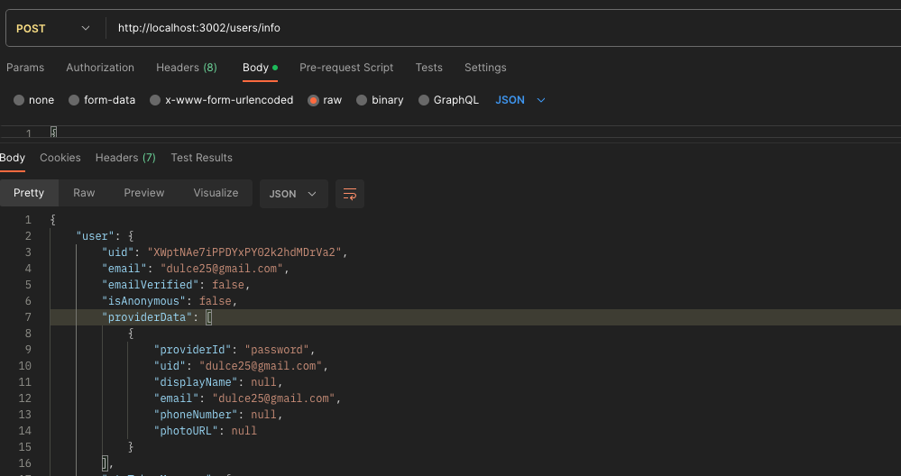

# Users Service

Users Service is a Node.js microservice for user management. It provides endpoints for user authentication, registration, profile management, and more. This service interacts with Firebase Authentication for user authentication and uses a PostgreSQL database to store user data.

## Features

- User registration
- User authentication (login)
- Profile management (update user details)
- Middleware for parameter validation

## Technologies Used

- Node.js
- Express.js
- Firebase Authentication
- PostgreSQL
- Microservices architecture
- Middleware for parameter validation

## Installation

1. Clone the repository:

   ```bash
   git clone https://github.com/devmaiko/users-service-js.git
   ```

2. Install dependencies:

   ```bash
   cd users-service
   npm install
   ```

3. Set up Firebase Authentication and PostgreSQL database. Update the configuration accordingly.

4. Run the service:

   ```bash
   npm start
   ```

## Configuration

The service requires configuration for Firebase Authentication and PostgreSQL database. You can provide configuration using environment variables or configuration files.

### Firebase Authentication Configuration

```bash
FIREBASE_API_KEY=<your-firebase-api-key>
FIREBASE_AUTH_DOMAIN=<your-firebase-auth-domain>
FIREBASE_PROJECT_ID=<your-firebase-project-id>
```

### PostgreSQL Configuration

```bash
DB_HOST=<your-postgres-host>
DB_PORT=<your-postgres-port>
DB_USER=<your-postgres-username>
DB_PASSWORD=<your-postgres-password>
DB_DATABASE=<your-postgres-database>
```

## Usage

The service exposes HTTP endpoints for user management operations. Here are some example endpoints:

- `POST /users`: create user in database and firebase.
- `POST /users/info`: get user info from firebase.


## Middleware for Parameter Validation

The service includes middleware to validate request parameters before processing them. This ensures that only valid data is accepted by the service. You can find the middleware in the `middlewares/validateParams.js` file.

## Contributing

Contributions are welcome! If you'd like to contribute to Users Service, please follow the standard GitHub flow: fork the repository, make changes, and submit a pull request.


